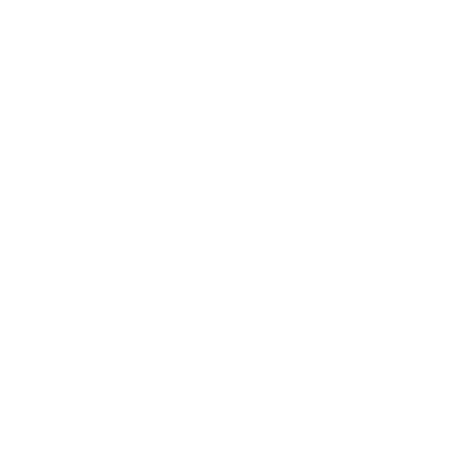

# favicons
ブックマークバーに仕切りをつけるために、ファビコンだけあるページを用意します。

## 線

### bar-black

[リンク](https://higurashi-takuto.github.io/favicons/bar-black/index.html)

見本

### bar-gray

[リンク](https://higurashi-takuto.github.io/favicons/bar-gray/index.html)

見本

### bar-white

[リンク](https://higurashi-takuto.github.io/favicons/bar-white/index.html)

見本

## スラッシュ

### slash-black

[リンク](https://higurashi-takuto.github.io/favicons/slash-black/index.html)

見本

### slash-gray

[リンク](https://higurashi-takuto.github.io/favicons/slash-gray/index.html)

見本

### slash-white

[リンク](https://higurashi-takuto.github.io/favicons/slash-white/index.html)

見本

## 四角

### square-black

[リンク](https://higurashi-takuto.github.io/favicons/square-black/index.html)

見本

### square-gray

[リンク](https://higurashi-takuto.github.io/favicons/square-gray/index.html)

見本

### square-white

[リンク](https://higurashi-takuto.github.io/favicons/square-white/index.html)

見本

